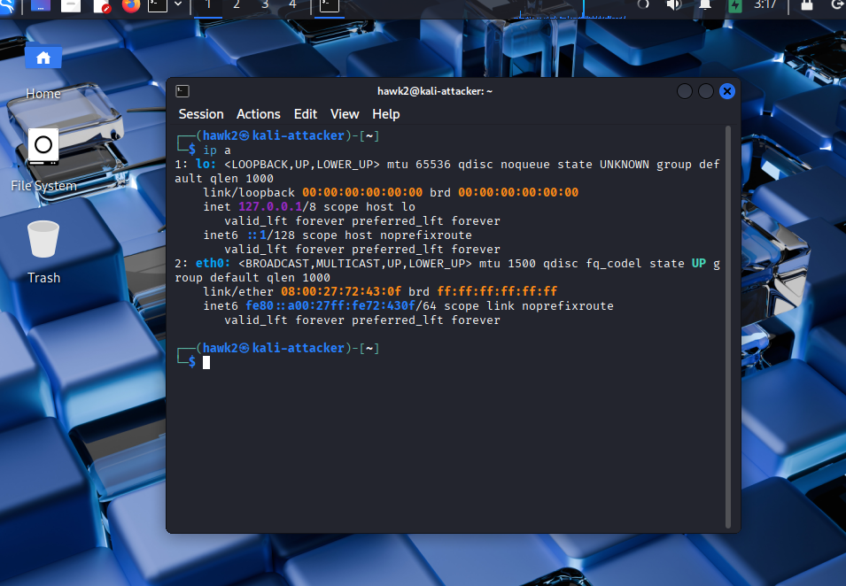
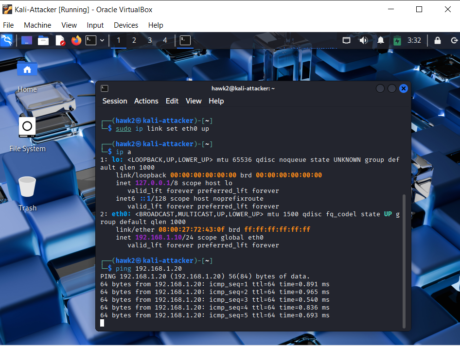
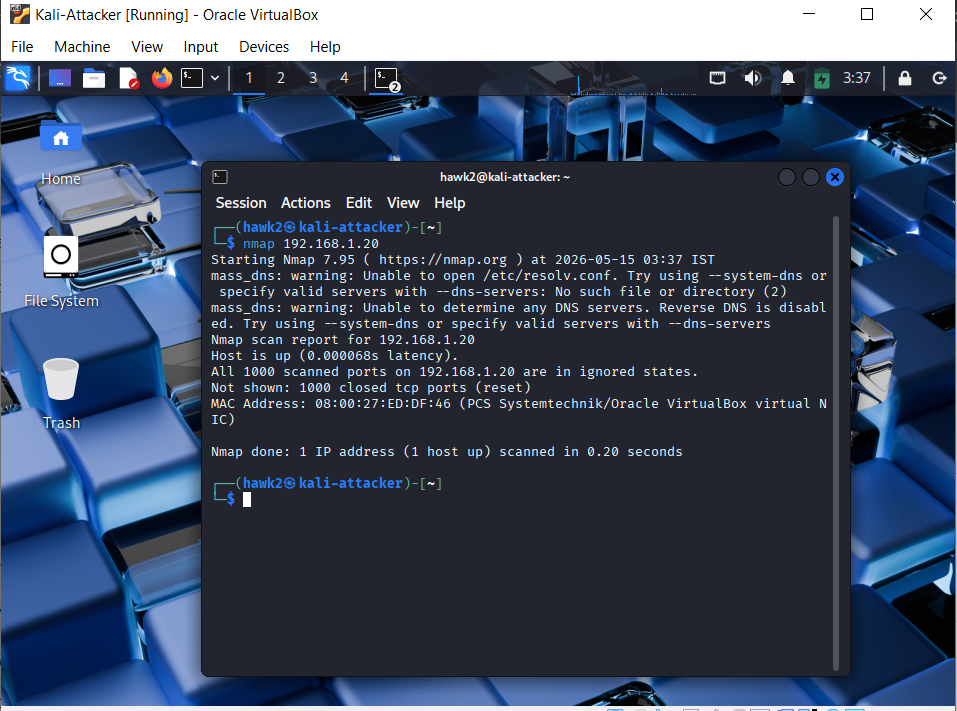
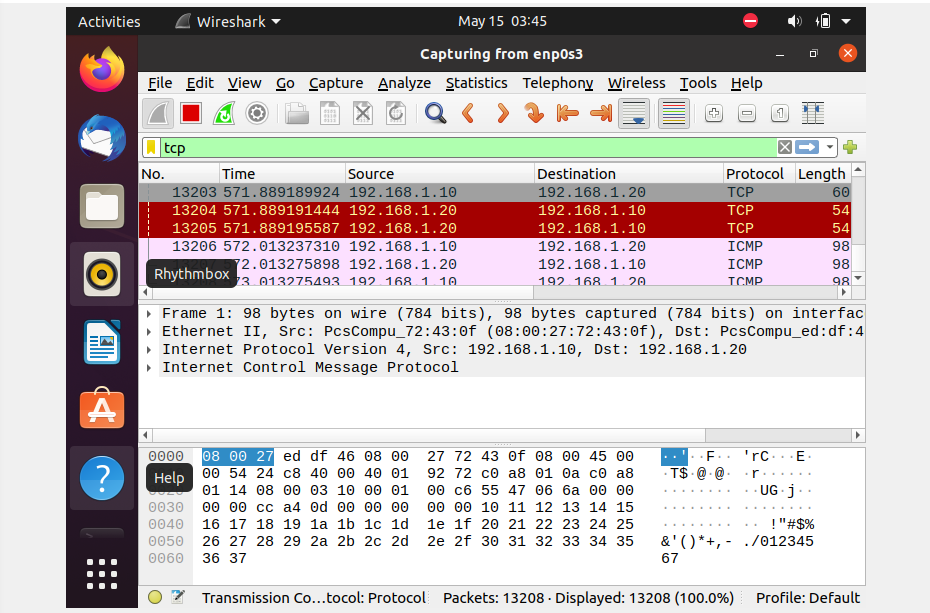
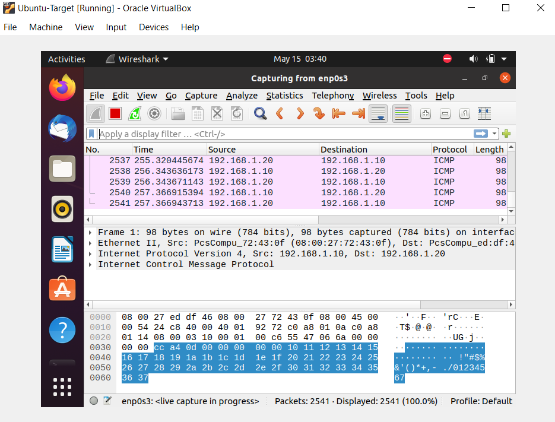
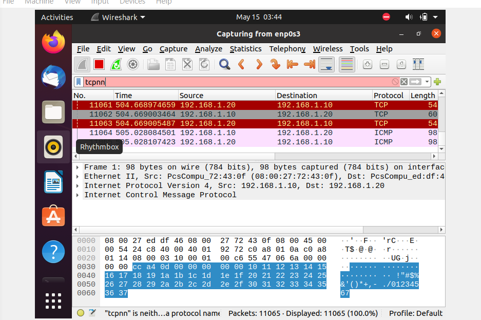

# 🚨 Network Intrusion Detection Lab

## 📌 Objective
To simulate a network-based attack (port scanning) and analyze the generated traffic to understand how intrusion attempts can be detected using packet-level inspection.

---

## 🧠 Lab Environment

- Attacker Machine: Kali Linux  
- Target Machine: Ubuntu  
- Network Type: Internal Virtual Network (lab-net)  
- IP Configuration:
  - Kali: 192.168.1.10
  - Ubuntu: 192.168.1.20  

---

## ⚔️ Tools Used

- Nmap – for performing port scanning (attack simulation)  
- Wireshark – for capturing and analyzing network traffic  

---

## 🔍 Methodology

### 1. Network Configuration
- Assigned static IPs to both machines
- Verified connectivity using ping

### 2. Attack Simulation
- Executed SYN scan using:
  nmap -sS 192.168.1.20

### 3. Traffic Capture
- Started packet capture on the Ubuntu machine using Wireshark
- Monitored incoming traffic during the scan

### 4. Traffic Analysis
- Applied filters:
  tcp
  tcp.flags.syn == 1
- Identified multiple SYN packets targeting different ports

---

## 📸 Screenshots

### Kali IP Configuration

### Ping Test (Connectivity Verification)

### Nmap Scan (Attack Simulation)

### Ubuntu IP Configuration

### Wireshark Packet Capture

### Packet Analysis (SYN Detection)

---

## 🔎 Analysis & Findings

- A high volume of TCP SYN packets were observed from the attacker machine  
- Packets were directed toward multiple ports in a short time interval  
- This behavior indicates a port scanning (reconnaissance) attack  
- Packet-level indicators observed:
  - Source and destination IP addresses  
  - TCP flags (SYN)  
  - Protocol type (TCP/ICMP)  

---

## 🎯 Conclusion

This project demonstrates how intrusion attempts like port scanning can be detected through network traffic monitoring and packet analysis.

---

## 🚀 Future Enhancements

- Integrate Snort for real-time intrusion detection  
- Use ELK Stack for log monitoring and visualization  
- Extend detection to brute-force and DoS attacks  
- Automate alert generation for suspicious traffic  

---

## 🧨 One-Line Summary

Simulated a port scanning attack and detected it using packet-level traffic analysis.
